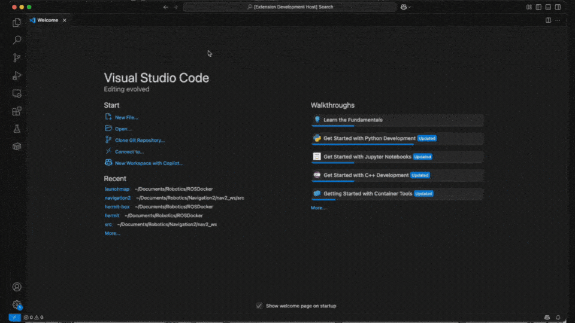

<p align="center">
  
</p>

[](https://marketplace.visualstudio.com/items?itemName=KodoRobotics.launchmap)
[](./LICENSE)

**LaunchMap** is a Visual Studio Code extension that lets you visualize the structure of ROS 2 launch files as interactive graphs directly inside VSCode.

Whether you are debugging a complex `launch.py`, exploring a new package, or onboarding to a robotics stack, LaunchMap helps you **see what is really happening** in your launch files.



---

## ✨ Features

- Visualizes ROS 2 launch files as interactive graphs
- Supports core launch constructs like:
  - `Node(...)`
  - `IncludeLaunchDescription(...)`
  - `GroupAction(...)`
  - `DeclareLaunchArgument(...)`
  - `LaunchConfiguration(...)`
- Traces argument usage and include relationships
- Opens the graph in a **new tab** within VSCode
- Displays a warning banner for unsupported or skipped components

---

## 📦 Installation

Install from the [Visual Studio Code Marketplace](https://marketplace.visualstudio.com/items?itemName=KodoRobotics.launchmap), or use the CLI:

```bash
code --install-extension KodoRobotics.launchmap
```
---

## ▶️ How to Use

1. Open a `.launch.py` file in VSCode.
2. Open the Command Palette (`Ctrl+Shift+P` or `Cmd+Shift+P`).
3. Run: **Open Launch Visualizer**

The graph will open in a new editor tab.

---

### 🚀 Quick Start Example

Don't have a `.launch.py` file handy? No problem!  
You can quickly test the visualizer by creating a new file (e.g., `hello.launch.py`) and pasting the following code:

```python

    from launch import LaunchDescription
    from launch_ros.actions import Node

    def generate_launch_description():
        return LaunchDescription([
            Node(
                package='demo_nodes_cpp',
                executable='talker',
                name='my_talker'
            ),
            Node(
                package='demo_nodes_cpp',
                executable='listener',
                name='my_listener'
            )
        ])
```
Now, open this file and run the **Open Launch Visualizer** command!

---

## ✅ Construct Support Status

| Construct                        | Status            |
|----------------------------------|-------------------|
| `Node(...)`                      | ✅ Supported      |
| `IncludeLaunchDescription(...)`  | ✅ Supported      |
| `GroupAction(...)`               | ✅ Supported      |
| `DeclareLaunchArgument(...)`     | ✅ Supported      |
| `LaunchConfiguration(...)`       | ✅ Supported      |
| `SetParameter(...)`              | ⚠️ Not yet parsed |
| `ComposableNode(...)`            | ⚠️ Not yet parsed |
| `IfCondition(...)`               | ⚠️ Not yet parsed |

> A banner at the top of the graph view shows which components were skipped.

---

## 🐛 Known Limitations

- Some advanced constructs like `ComposableNode` are skipped.
- Launch files are parsed statically (not executed).
- Layout may be suboptimal for large or deeply nested graphs.

---

## 📜 License

Licensed under the Apache 2.0 License.  
Copyright © 2025 Kodo Robotics.

---

## 📚 Getting Started with ROS 2

New to the ROS 2 ecosystem? Here are some great resources to get you started:

- [Official ROS 2 Documentation](https://docs.ros.org/en/rolling/)
- [ROS 2 Humble Tutorials](https://docs.ros.org/en/humble/Tutorials.html)
- [Articulated Robotics' ROS 2 YouTube Tutorials](https://www.youtube.com/@ArticulatedRobotics)

---

## 🤝 Contributing

Contributions are welcome!
Please open an issue, suggest a feature, or submit a pull request.